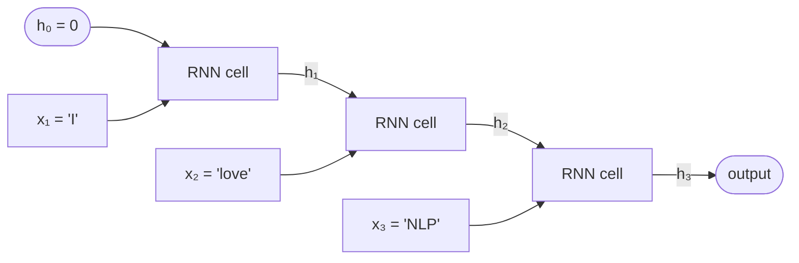

# Q5: RNN — Descriptive

## Question Summary

Draw a vanilla RNN processing the sentence **"I love NLP"** one token at a time, labelling the hidden states h₁, h₂, h₃ and showing how each depends on the previous one.

Then explain why this architecture struggles with:

> "The student who studied hard for the exam that was scheduled for Friday finally passed"

What information is likely lost by the time the RNN reaches "passed"?

---

## Part 1: Processing "I love NLP"

A vanilla RNN reads one token at a time, left to right. At each step it updates a hidden state, a fixed-size vector that acts as the network's running memory:

```text
h_t = tanh(W · h_(t-1) + U · x_t + b)
```

- `x_t` is the embedding of the current token
- `h_(t-1)` is the previous hidden state (`h₀ = 0`)
- `W`, `U`, `b` are learned parameters, **shared across all time steps**

### Unrolled diagram



### Step-by-step

| Step | Computation | What the hidden state holds |
|---|---|---|
| 1 | `h₁ = tanh(W·h₀ + U·x₁ + b)` | Only "I", since it starts from zero memory |
| 2 | `h₂ = tanh(W·h₁ + U·x₂ + b)` | A compressed summary of "I love" |
| 3 | `h₃ = tanh(W·h₂ + U·x₃ + b)` | A compressed summary of "I love NLP" |

Each hidden state depends on the current token **and** the previous hidden state, so information flows forward through the chain h₁ → h₂ → h₃.

---

## Part 2: Why the RNN struggles with the long sentence

When the RNN reaches **"passed"**, it needs to know that the subject is **"The student"**. But 12 tokens sit between them:

```text
The student [who studied hard for the exam that was scheduled for Friday] finally passed
     ↑                                                                            ↑
  subject                                                                       verb
```

By the time it reaches "passed", the hidden state is dominated by the most recent tokens ("scheduled for Friday", "finally"). The information that **"the student" is the one who passed** has largely faded.

### Three compounding problems

1. **Repeated compression.** At each step, tanh squashes the mix of old state and new input into the range (−1, 1). Older signals are diluted a little more with every token.
2. **Fixed-size bottleneck.** The hidden state has the same size for a 3-token sentence and a 15-token sentence. There is no extra capacity to hold more history.
3. **Vanishing gradients during training.** Backpropagation through time multiplies many derivatives smaller than 1. The gradient linking "passed" back to "student" shrinks exponentially, so the network never learns to preserve that information across such a distance.

---

## Final Answer

In a vanilla RNN, each hidden state is computed from the previous hidden state and the current token, so h₃ summarizes "I love NLP". In the long sentence, the subject "The student" appears 12 tokens before "passed". Because the hidden state is repeatedly compressed, has fixed size, and is trained with vanishing gradients, the link between **who** (the student) and **what happened** (passed) is likely lost. The RNN may instead associate "passed" with recent nouns such as "exam" or "Friday".

LSTMs address this with a gated cell state (Q7, Q8). Transformers go further: attention connects any two positions directly, regardless of distance.
