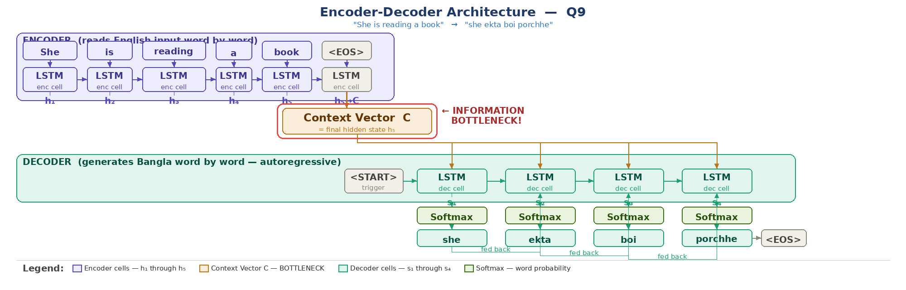

# Q9: Encoder-Decoder — Descriptive

## Question Summary

Draw the basic encoder-decoder architecture for translating **"She is reading a book"** into Bangla **"she ekta boi porchhe"**. Label the encoder hidden states h₁–h₅, the context vector C, the decoder states s₁–s₄, and the softmax output at each decoder step. Where exactly does the information bottleneck occur?

---

## Architecture Diagram



*Purple: encoder. Amber: context vector C (the bottleneck). Teal: decoder.*

The encoder-decoder (sequence-to-sequence) model maps a variable-length input sequence to a variable-length output sequence (Sutskever et al., 2014):

- **Encoder:** reads the English sentence word by word with an LSTM. Its final hidden state becomes the context vector **C**.
- **Decoder:** another LSTM that starts from C and generates one Bangla word per step through a softmax layer. Each generated word is fed back as the next input (**autoregressive** generation).

---

## Step 1: Encoder Hidden States h₁–h₅

Each encoder state is computed as `h_t = LSTM(h_(t-1), x_t)`, where `x_t` is the embedding of the current word:

| State | Input word | What the state has accumulated |
|---|---|---|
| h₁ | She | Subject: female, singular |
| h₂ | is | Present-tense auxiliary, ongoing action |
| h₃ | reading | The action: reading, continuous |
| h₄ | a | An indefinite object is coming |
| h₅ | book | The object: book; the whole sentence is now encoded |

The states chain left to right (h₁ → h₂ → … → h₅), so h₅ summarizes the entire sentence.

---

## Step 2: Context Vector C

```text
C = h₅
```

C is the **only** bridge between encoder and decoder. In Sutskever et al. (2014), it initializes the decoder (`s₀ = C`); in Cho et al. (2014), it is also fed to every decoder step, as drawn in the figure. In both cases, the decoder has no access to h₁–h₄.

For scale, the Sutskever model's context was 8,000 numbers (1,000 units × 4 LSTM layers × 2 states: hidden and cell).

---

## Step 3: Decoder States s₁–s₄ and Softmax Outputs

At each step, the decoder state `s_t` passes through a linear layer and a **softmax** over the Bangla vocabulary, and the most probable word is emitted:

| Step | State | Input | Softmax output |
|---|---|---|---|
| 1 | s₁ | `<START>` + C | **she** |
| 2 | s₂ | "she" | **ekta** |
| 3 | s₃ | "ekta" | **boi** |
| 4 | s₄ | "boi" | **porchhe**, then `<EOS>` |

Example softmax at step 1:

| Candidate | Probability |
|---|---:|
| she | 0.82 ✔ |
| ami | 0.08 |
| ta | 0.05 |
| all others | 0.05 |

**Teacher forcing (training only):** during training, the decoder receives the correct previous Bangla word instead of its own prediction. This avoids cascading errors early in training. At inference, it uses its own outputs, as in the table above.

---

## Where Is the Information Bottleneck?

The bottleneck is **at the context vector C**, the single arrow from the encoder's final state h₅ to the decoder.

All information about the source sentence must pass through this one fixed-size vector, whatever the sentence length:

| Input length | Size of C | Effect |
|---|---|---|
| Short (5 words, this example) | Fixed | Enough capacity; good translation |
| Medium (~20 words) | Fixed | Mostly fine; minor details may be lost |
| Long (40+ words) | Fixed | Significant information loss; quality degrades |

The **attention mechanism** (Bahdanau et al., 2015) removes this single-vector bottleneck: at every decoding step, the decoder computes a weighted combination of **all** encoder states h₁–h₅. The **Transformer** (Vaswani et al., 2017) later replaced recurrence entirely with attention.

---

## Final Answer

The encoder LSTM reads "She is reading a book" and produces hidden states h₁–h₅. The final state h₅ becomes the context vector C. The decoder LSTM is initialized from C and produces states s₁–s₄, each followed by a softmax that emits "she", "ekta", "boi" and "porchhe" in turn, with each output fed back as the next input. The information bottleneck occurs **at C**, because the entire source sentence must be compressed into this single fixed-size vector, and the decoder cannot look at any other encoder state.

---

## References

- Sutskever, I., Vinyals, O., & Le, Q. V. (2014). Sequence to Sequence Learning with Neural Networks. *NeurIPS*.
- Cho, K., et al. (2014). Learning Phrase Representations using RNN Encoder–Decoder for Statistical Machine Translation. *EMNLP*.
- Bahdanau, D., Cho, K., & Bengio, Y. (2015). Neural Machine Translation by Jointly Learning to Align and Translate. *ICLR*.
