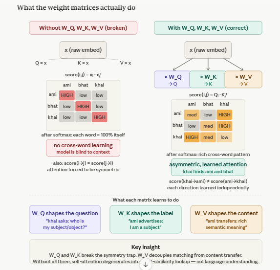

# Q13: Linear Transformation in Self-Attention — Analytic

## Question Summary

In self-attention, the input embedding `x` is multiplied by three separate weight matrices `W_Q`, `W_K` and `W_V` to produce the Query, Key and Value vectors.

1. Why would using the raw embedding `x` directly for all three roles severely limit what self-attention can learn?
2. What would happen to the attention weights if `Q = K = V = x`?

---

## Overview



Removing the three projections breaks self-attention in three separate ways.

---

## Problem 1: Self-Similarity Dominates

With `Q = K = x`, the score from word i to word j is a plain dot product of embeddings:

```text
score(i → j) = x_i · x_j
```

For a word attending to itself:

```text
score(i → i) = x_i · x_i = ‖x_i‖²
```

By the Cauchy–Schwarz inequality, `x_i · x_j ≤ ‖x_i‖ ‖x_j‖`, and in high dimensions (e.g., d = 512) unrelated vectors are nearly orthogonal. So the diagonal score `‖x_i‖²` is **usually much larger** than any cross-word score, unless another word has a much larger norm and points in a similar direction.

After softmax, the weights tend to collapse onto the diagonal:

```text
α(i → i) ≈ 1
α(i → j) ≈ 0   for j ≠ i
```

Each word mostly attends to itself, so little information moves between words. The output is close to the input.

---

## Problem 2: Attention Is Forced to Be Symmetric

The dot product is commutative:

```text
score(i → j) = x_i · x_j = x_j · x_i = score(j → i)
```

So the score matrix `X Xᵀ` is symmetric by construction. But language relationships are **directional**. In **"ami bhat khai"** (I eat rice):

- "khai" (eat) needs to attend strongly to "ami" (I), to know who is eating.
- "ami" does not need to attend to "khai" with the same strength; it needs different context.

With separate projections, the score becomes `(x_i W_Q) · (x_j W_K)`, which in general differs from `(x_j W_Q) · (x_i W_K)`. `W_Q` and `W_K` break the symmetry.

---

## Problem 3: One Vector Cannot Serve Two Different Purposes

With `V = x` as well, the same vector is used for two different jobs:

- **Matching (Key):** should be compact and discriminative, so that relevant words score high and irrelevant ones low.
- **Content transfer (Value):** should carry the semantic information that is useful to pass on to other words.

`W_K` can project `x` into a subspace suited to matching, while `W_V` projects it into a subspace suited to content. Without the separation, one vector must compromise and does neither job well.

---

## What Happens When Q = K = V = x

| Property | With `W_Q`, `W_K`, `W_V` | With `Q = K = V = x` |
|---|---|---|
| Diagonal | Learned, flexible | Tends to dominate (self-attention to itself) |
| Symmetry | Directional | Score matrix forced to be symmetric |
| Roles | Q, K, V in separate learned subspaces | All three identical |
| Learnable attention parameters | Yes | None |
| Output | Rich contextual embeddings | Close to the input embeddings |

The attention weights become a **fixed function of raw embedding similarity**: mostly diagonal, symmetric before softmax, and not adaptable to the task.

---

## The Deeper Reason: Learnable Projections

Each of `W_Q`, `W_K`, `W_V` (shape `d_model × d_k`) is a learned linear projection trained by gradient descent:

- `W_Q` learns to shape queries so that each word *asks for* the right context,
- `W_K` learns to shape keys so that the right words *are found*,
- `W_V` learns to shape values so that *useful* information is transferred.

Without them, the attention mechanism has **no learnable parameters** and cannot adapt its matching to the task. It reduces to a fixed similarity lookup over raw embeddings, much like the similarity structure Word2Vec already provides.

---

## Final Answer

Using the raw embedding for Query, Key and Value removes all learnable parameters from attention. Three problems follow: (1) each word's score with itself, `‖x_i‖²`, usually dominates, so attention collapses onto the diagonal and words barely exchange information; (2) the score matrix is forced to be symmetric, although linguistic relationships are directional; (3) one vector must serve both as a matching key and as transferred content. With `Q = K = V = x`, the attention weights become a fixed, mostly diagonal function of embedding similarity, and the outputs stay close to the original embeddings. The separate projections `W_Q`, `W_K`, `W_V` are what make attention learnable, asymmetric and role-specific.
