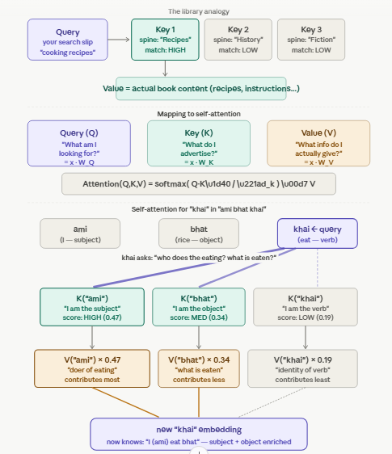

# Q14: Query, Key, Value — Descriptive

## Question Summary

Using a **library search analogy**, explain the roles of Query, Key and Value in self-attention. Then map the analogy to the sentence **"ami bhat khai"** (I eat rice). When self-attention processes **"khai"** (eat):

- what is the Query asking,
- which Keys is it compared against,
- which Values does it collect?

---

## The Library Analogy

Imagine walking into a library to learn about cooking.

- You carry a search slip that says *"cooking recipes"*. That slip is your **Query**: what you are looking for right now.
- Every book has a label on its spine: *"Recipes"*, *"History"*, *"Science"*. Those labels are the **Keys**: what each book advertises about itself.
- When a spine label matches your slip, you take the book and read it. The content inside is the **Value**: the information you actually take away.

You do not read every book equally. You **compare your Query against every Key**, score how well each matches, then spend your reading time **in proportion to the match**: most on the best match, a little on partial matches, almost none on irrelevant books. What you walk out knowing is a **weighted blend of Values**.

| Library | Self-attention | Formula |
|---|---|---|
| Your search slip | Query (Q) | `x · W_Q` |
| Spine label on each book | Key (K) | `x · W_K` |
| Content inside the book | Value (V) | `x · W_V` |
| How well the slip matches a spine | Attention score | `Q · Kᵀ / √d_k` |
| How much of each book you read | Attention weight | softmax of the scores |
| What you walk out knowing | New contextual embedding | weighted sum of V |

**Why keep them separate?** If a book's label, its content and your search slip were all the same thing, every book would match itself best, which tells you nothing. Separate Q, K and V let the model learn **directional** relationships: "khai" can ask "who is eating?" without "ami" having to ask the same question back.

---

## Mapping to "ami bhat khai"

| Word | Meaning | Role |
|---|---|---|
| ami | I | subject |
| bhat | rice | object |
| khai | eat | verb |

### What is the Query of "khai" asking?

> "As the verb *eat*, what context do I need? **Who** is doing the eating, and **what** is being eaten?"

### Which Keys is it compared against?

The Query of "khai" is compared against the **Key of every word in the sentence, including itself**:

- Key of "ami": advertises *"I am a first-person subject"*
- Key of "bhat": advertises *"I am a food noun, a likely object"*
- Key of "khai": advertises *"I am a verb"*

### Which Values does it collect?

It collects a **weighted combination of all three Values**, weighted by how well each Key matched:

- **High weight on "ami"**: tells "khai" *who* performs the action
- **High weight on "bhat"**: tells "khai" *what* is being eaten
- **Lower weight on "khai" itself**: keeps its own lexical meaning

**Result:** the new embedding of "khai" is no longer a generic "eat" vector. It becomes a sentence-specific vector encoding *"I am the eating done by 'ami' to 'bhat'"*.

---

## Final Answer

In the library analogy, the **Query** is the search slip (what a word is looking for), the **Keys** are the spine labels (what each word advertises), and the **Values** are the book contents (the information actually transferred). The output is a weighted blend of Values, with weights from the Query–Key matches. When processing "khai" in "ami bhat khai", the Query asks *who is eating and what is eaten*. It is compared against the Keys of "ami", "bhat" and "khai", and it collects mainly the Values of "ami" (the subject) and "bhat" (the object), plus some of its own. The resulting contextual embedding of "khai" encodes the complete action: I eat rice.
