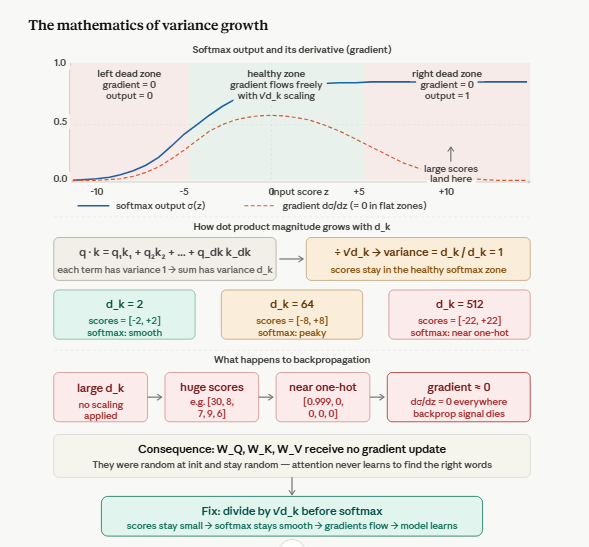

# Q16: Scaling by √d_k — Analytic

## Question Summary

The Transformer paper states that for large `d_k`, dot products grow large in magnitude and push softmax into regions with extremely small gradients.

1. Explain this statement in your own words.
2. What would happen to backpropagation if the softmax outputs were nearly one-hot?

---

## The Statement as a Chain of Three Problems



**1. Dot products grow with d_k.** `q · k` is a sum of `d_k` products. Adding more terms makes the result larger in magnitude, not because the words are more related, but simply because there are more numbers to add.

**2. Softmax saturates.** Softmax exponentiates the scores, so large gaps between scores become enormous ratios between weights. The output becomes nearly one-hot: one weight near 1 and the rest near 0, whether or not that word is truly the most relevant.

**3. Gradients vanish.** In this saturated region, the derivative of softmax is almost zero, so very little gradient flows back and learning stalls.

Dividing by `√d_k` breaks this chain at the first step.

---

## Why the Dot Product Grows: The Variance Argument

Assume each component of `q` and `k` is independent, with mean 0 and variance 1:

```text
q · k = q₁k₁ + q₂k₂ + ... + q_(d_k)·k_(d_k)
```

Each term `q_i k_i` has mean 0 and variance 1. For a sum of independent terms, variances add:

```text
Var(q · k) = d_k      →   standard deviation = √d_k
```

| d_k | Typical magnitude of q · k |
|---:|---:|
| 2 | ≈ 1.4 |
| 64 | ≈ 8 |
| 512 | ≈ 22.6 |

After scaling:

```text
Var(q · k / √d_k) = d_k / d_k = 1
```

The scores return to unit variance, so they stay roughly within ±2, where softmax behaves well.

---

## Saturation in Numbers

**Small scores (healthy):**

```text
scores  = [1.2, 0.4, 0.3]
softmax ≈ [0.54, 0.24, 0.22]     ← smooth; all weights can still change
```

**Large scores (d_k = 512, unscaled):**

```text
scores  = [22.0, 7.0, 6.5]
softmax ≈ [1.000, 0.000, 0.000]  ← near one-hot
```

---

## What Happens to Backpropagation

The softmax Jacobian is:

```text
∂p_i/∂s_j = p_i (1 − p_i)    if i = j
∂p_i/∂s_j = − p_i p_j         if i ≠ j
```

When the output is nearly one-hot (`p₁ ≈ 1`, all other `p_i ≈ 0`):

- winner: `p₁(1 − p₁) ≈ 1 × 0 = 0`
- losers: `p_i(1 − p_i) ≈ 0`, and cross terms `−p_i p_j ≈ 0`

So **every entry of the Jacobian is close to zero**, and almost no gradient reaches the scores. The consequences:

1. **The gradient through softmax dies:** `∂L/∂scores ≈ 0`.
2. **W_Q and W_K barely update.** Their gradients pass through the scores, so they receive almost no learning signal and stay close to their random initialization.
3. **Attention cannot learn.** With nearly frozen `W_Q` and `W_K`, the model cannot learn which words should attend to which. Attention patterns stay arbitrary, or improve only very slowly.
4. **Training of the whole model suffers.** Other paths, such as residual connections, still carry gradient, but the attention mechanism contributes little useful learning.

### One-hot attention is also semantically poor

Beyond gradients, language rarely depends on exactly one word. In **"ami bhat khai"**, the verb "khai" needs both "ami" (who eats) and "bhat" (what is eaten). A healthy distribution such as `[0.48, 0.34, 0.18]` blends information from all relevant words. A one-hot distribution `[1, 0, 0]` keeps only the subject and discards the object.

---

## Summary

| Stage | With √d_k scaling | Without scaling (large d_k) |
|---|---|---|
| Score magnitude | Variance ≈ 1, roughly ±2 | Variance = d_k, e.g. ±22 for d_k = 512 |
| Softmax output | Smooth distribution | Near one-hot |
| Softmax gradient | Healthy | ≈ 0 |
| W_Q, W_K updates | Learn useful patterns | Barely change |
| Attention | Meaningful and task-specific | Arbitrary or very slow to improve |

---

## Final Answer

When `d_k` is large, the dot product `q · k` sums many terms, so its variance grows to `d_k`. The resulting large scores push softmax into a saturated region where its output is nearly one-hot. There, every entry of the softmax Jacobian, `p_i(1 − p_i)` and `−p_i p_j`, is close to zero, so backpropagation delivers almost no gradient to the attention scores and hence to `W_Q` and `W_K`. Attention then cannot learn which words to focus on. Dividing by `√d_k` restores the scores to unit variance, keeping softmax smooth and gradients flowing.

---

## Reference

- Vaswani, A., et al. (2017). Attention Is All You Need. *NeurIPS*, Section 3.2.1 and footnote 4.
