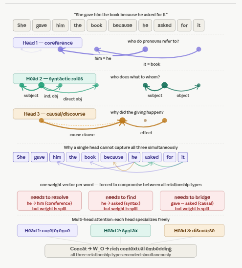

# Q17: Multi-Head Attention — Descriptive

## Question Summary

In the sentence **"She gave him the book because he asked for it"**, several kinds of relationships exist at once. Describe at least three linguistic relationships that three separate attention heads might learn. Why can't a single attention head capture all of them effectively?

---

## The Sentence

```text
She(1) gave(2) him(3) the(4) book(5) because(6) he(7) asked(8) for(9) it(10)
```

It contains two clauses joined by a causal connective, three pronouns referring to entities ("him", "he", "it"), and two predicate structures. Understanding it requires tracking all of these at once.



---

## Head 1: Coreference

**What it learns:** which pronouns refer to which entities.

- **"he" (7) → "him" (3):** the same person. The head learns that a masculine pronoun in the subordinate clause likely refers back to the masculine pronoun in the main clause.
- **"it" (10) → "book" (5):** the thing asked for is the book that was given.
- "She" has no antecedent in the sentence, so its coreference attention is diffuse.

Without this head, "he" and "him" would be treated as unrelated entities, and the model would miss that the person who asked is the person who received the book.

---

## Head 2: Syntactic Roles (Who Does What to Whom)

**What it learns:** links between each verb and its arguments.

- **Main clause:** "gave" attends to "She" (giver), "him" (recipient) and "book" (thing given). *Give* takes three arguments.
- **Subordinate clause:** "asked" attends to "he" (subject) and "it" (what was asked for, through "for").

This head produces a different pattern from Head 1. Head 1 links "he" to "him" **across** the clause boundary, while Head 2 links "he" to "asked" **within** its clause.

---

## Head 3: Causal / Discourse Structure

**What it learns:** how clauses connect logically.

- "because" attends to both "gave" (the effect) and "asked" (the cause).
- "gave" attends to "asked" across the clause boundary, linking the event to its reason.

This cross-clause causal link is a third kind of information. It is not captured by the syntax head, which focuses on arguments within each clause, nor by the coreference head.

---

## Why a Single Head Cannot Do All Three

A single head produces **one** attention distribution per query word, a set of weights summing to 1. But the three relationships need **different** distributions for the same word:

| Head | Where "he" should attend most | Why |
|---|---|---|
| Coreference | "him" (3) | Same person |
| Syntax | "asked" (8) | "he" is its subject |
| Discourse | "because" (6) | "he" is in the causal clause |

A single head must choose one distribution. Any compromise, such as splitting the weight across "him", "asked" and "because", has two costs:

1. **Diluted signal.** Each relationship gets only part of the 100% attention budget, so each is represented weakly.
2. **Averaged meanings.** The output is one weighted average of Value vectors, so information about coreference, syntax and discourse is blended into a single vector rather than kept distinct.

**Multi-head attention** solves this by running `h` attention operations in parallel. Each head has its **own** `W_Q`, `W_K`, `W_V`, so each can learn its own distribution in its own subspace. The head outputs are **concatenated** (not averaged) and mixed by `W_O`, so the final representation of "he" keeps all three kinds of information.

This specialization adds little cost. With `d_model = 512` and `h = 8`, each head works in `d_k = 64` dimensions, and the total computation is about the same as one 512-dimensional head (see Q18).

---

## Summary

| Head | Relationship | Key links | Lost without it |
|---|---|---|---|
| 1 | Coreference | he → him, it → book | Pronoun resolution |
| 2 | Syntactic roles | gave → She / him / book, asked → he / it | Who did what to whom |
| 3 | Causal discourse | because ↔ gave, asked | Why the giving happened |
| Single head | Forced compromise | One averaged pattern | Partial information on all, full on none |

*Note: the specific roles above are illustrative. Real trained heads do not always specialize this cleanly, although analyses of trained models have found heads that track coreference and syntactic relations.*

---

## Final Answer

Three heads might learn (1) **coreference**, linking "he" to "him" and "it" to "book"; (2) **syntactic roles**, linking "gave" to "She", "him" and "book", and "asked" to "he" and "it"; and (3) **causal discourse structure**, linking "gave" and "asked" through "because". A single head cannot capture all three well, because it produces only one attention distribution per word. For "he", the three relationships require attending to different words ("him", "asked", "because"), so one distribution must compromise, diluting and averaging the signals. Multi-head attention gives each relationship its own projections and attention pattern, then concatenates the results, at about the same computational cost as a single full-width head.

---

## Reference

- Clark, K., Khandelwal, U., Levy, O., & Manning, C. D. (2019). What Does BERT Look At? An Analysis of BERT's Attention. *BlackboxNLP*.
