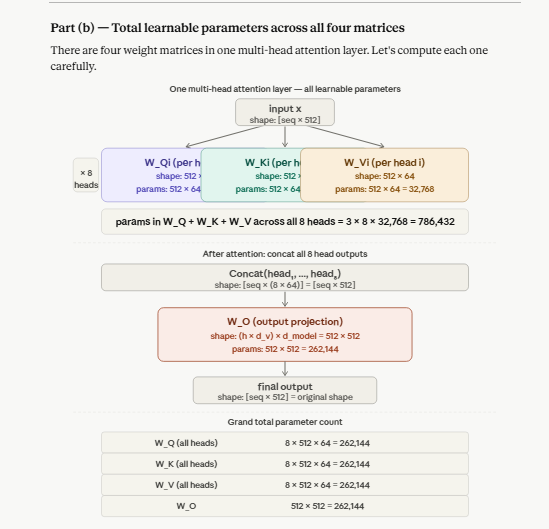
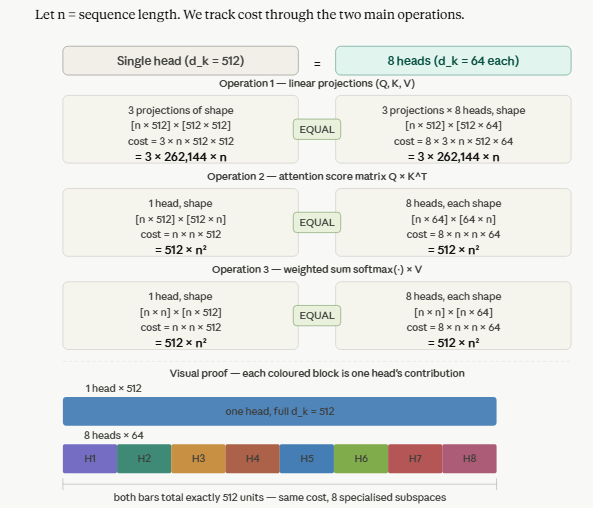

# Q18: Multi-Head Attention — Exercise

## Question Summary

A Transformer has `d_model = 512` and `h = 8` attention heads.

1. What is the dimension `d_k` of each head's Query and Key vectors?
2. How many learnable parameters are in `W_Q`, `W_K`, `W_V` and `W_O` combined for one multi-head attention layer? (Assume `d_v = d_k`; ignore biases.)
3. Show that the computational cost of 8 heads with `d_k = 64` is approximately the same as a single head with `d_k = 512`.

---

## Part A: Per-Head Dimension

The model dimension is split equally across the heads:

```text
d_k = d_v = d_model / h = 512 / 8 = 64
```

Each head's Query, Key and Value vectors are **64-dimensional**.

---

## Part B: Learnable Parameters



**W_Q:** one `512 × 64` matrix per head

```text
per head:     512 × 64 = 32,768
all 8 heads:  8 × 32,768 = 262,144
```

**W_K:** same shape as `W_Q`

```text
8 × 512 × 64 = 262,144
```

**W_V:** same shape, since `d_v = d_k = 64`

```text
8 × 512 × 64 = 262,144
```

**W_O:** one matrix shared by all heads. The 8 head outputs (64 dimensions each) are concatenated into `8 × 64 = 512` dimensions, then projected back to `d_model`:

```text
(h × d_v) × d_model = 512 × 512 = 262,144
```

**Total:**

| Matrix | Shape | Parameters |
|---|---|---:|
| W_Q (8 heads) | 8 × (512 × 64) | 262,144 |
| W_K (8 heads) | 8 × (512 × 64) | 262,144 |
| W_V (8 heads) | 8 × (512 × 64) | 262,144 |
| W_O | 512 × 512 | 262,144 |
| **Total** | | **1,048,576** |

```text
Total = 4 × d_model² = 4 × 512² = 1,048,576 ≈ 1.05 million
```

All four terms are equal because `h × d_k = d_model`, so each set of per-head projections together forms a `d_model × d_model` matrix, the same size as `W_O`.

---

## Part C: Computational Cost



Let `n` be the sequence length. Count multiplications for the three main operations.

### Single head, d_k = 512

```text
Q, K, V projections:  3 × [n × 512]·[512 × 512]  →  3 × n × 512 × 512 = 786,432·n
Scores Q·Kᵀ:          [n × 512]·[512 × n]        →  n × n × 512       = 512·n²
Weighted sum A·V:     [n × n]·[n × 512]          →  n × n × 512       = 512·n²

Total ≈ 786,432·n + 1,024·n²
```

### Eight heads, d_k = 64 each

```text
Projections:   8 × 3 × n × 512 × 64 = 786,432·n   ← same
Scores:        8 × (n × n × 64)     = 512·n²       ← same
Weighted sum:  8 × (n × n × 64)     = 512·n²       ← same

Total ≈ 786,432·n + 1,024·n²
```

### The key identity

```text
8 heads × (n² × 64) = n² × (8 × 64) = n² × 512 = 1 head × (n² × 512)
```

This works because

```text
h × d_k = h × (d_model / h) = d_model      (8 × 64 = 512)
```

Multiplying the number of heads by `h` while dividing each head's dimension by `h` leaves the total work unchanged. (The output projection `W_O` adds `n × 512 × 512` in the multi-head case. Vaswani et al. still describe the total cost as similar to single-head attention with full dimensionality.)

---

## Final Answer

```text
(a) d_k = 512 / 8 = 64

(b) W_Q + W_K + W_V + W_O = 4 × 262,144 = 1,048,576 parameters

(c) 8 heads × (n² × 64) = n² × 512 = cost of 1 head with d_k = 512
```

Splitting `d_model` across heads gives eight independently learned attention subspaces for essentially the same computational cost as one undivided head. This is why multi-head attention is practical as well as expressive.

---

## Reference

- Vaswani, A., et al. (2017). Attention Is All You Need. *NeurIPS*, Section 3.2.2.
