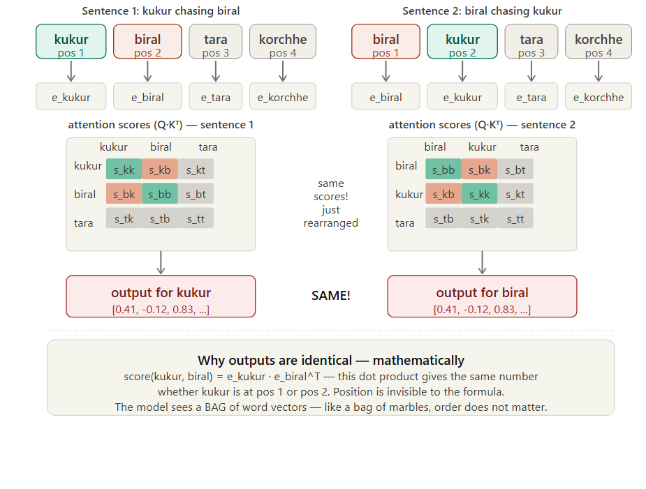
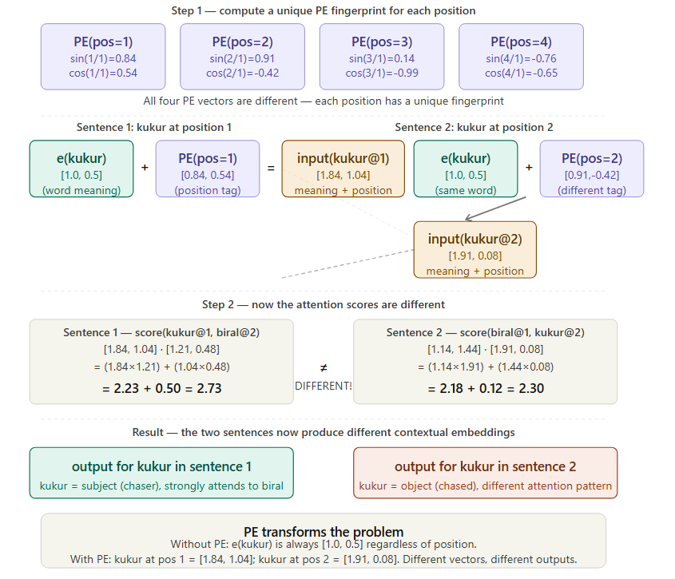

# Q19: Positional Encoding — Descriptive

## Question Summary

Explain why a Transformer **without positional encoding** would produce the same output for:

- **"kukur biralke tara korchhe"** (The dog is chasing the cat)
- **"biral kukurke tara korchhe"** (The cat is chasing the dog)

Then explain how **sinusoidal positional encoding** solves this.

---

## Why Word Order Matters

The two sentences use the same content words in a different order, with opposite meanings:

- "**kukur** biralke tara korchhe": the **dog** is the chaser
- "**biral** kukurke tara korchhe": the **cat** is the chaser

A model that cannot tell these apart cannot understand who did what.

*Note on tokens:* strictly, "biralke" and "kukurke" carry the object suffix *-ke*, so the surface words are not identical. The question treats the sentences as the same bag of words. This is exact with subword tokenization: both become `{kukur, biral, -ke, tara, korchhe}` in different orders. The argument below assumes this.

---

## Self-Attention Has No Notion of Order

```text
Attention(Q, K, V) = softmax(Q·Kᵀ / √d_k) · V
```

Every word's Query is compared with every word's Key. The formula contains **no position term**: it only sees the content of each vector, not where it appears.

When the input tokens are reordered, the same vectors produce the same pairwise dot products, only in a reordered matrix. Each token therefore gets **exactly the same output vector**, whatever its position. Formally, self-attention is **permutation-equivariant**: permuting the input simply permutes the outputs. Any order-independent summary of the outputs, such as mean pooling for classification, is identical for both sentences.



### Proof with numbers

Use tiny 2D embeddings:

```text
e(kukur)   = [1.0, 0.5]
e(biral)   = [0.3, 0.9]
e(tara)    = [0.7, 0.2]
e(korchhe) = [0.1, 0.8]
```

The score between "kukur" and "biral" is always:

```text
e(kukur) · e(biral) = (1.0 × 0.3) + (0.5 × 0.9) = 0.30 + 0.45 = 0.75
```

It is 0.75 whether "kukur" is at position 1 or 2. The scores, the softmax weights, and the weighted sums of Values are all unchanged. The model receives a **bag of vectors** and cannot tell the chaser from the chased.

---

## How Sinusoidal Positional Encoding Fixes This

Before the first layer, a position-dependent vector is **added** to each word embedding:

```text
PE(pos, 2i)   = sin(pos / 10000^(2i / d_model))
PE(pos, 2i+1) = cos(pos / 10000^(2i / d_model))
```

Each vector now encodes *meaning at this position*:

```text
input(kukur at pos 1) = e(kukur) + PE(1) = [1.0, 0.5] + [0.84, 0.54]  = [1.84, 1.04]
input(kukur at pos 2) = e(kukur) + PE(2) = [1.0, 0.5] + [0.91, −0.42] = [1.91, 0.08]
```

The same word at different positions is now a **different vector**, so its dot products change:

```text
Sentence 1: score(kukur@1, biral@2) = [1.84, 1.04] · [1.21, 0.48] ≈ 2.73
Sentence 2: score(biral@1, kukur@2) = [1.14, 1.44] · [1.91, 0.08] ≈ 2.29
```

The two sentences now produce different attention patterns and different outputs.



### Why sines and cosines?

- **Bounded:** values always stay in [−1, +1]. Adding raw position numbers (1, 2, …, 50) would swamp the word's meaning.
- **Length-independent:** normalized positions (pos/n) would give the same word different codes in sentences of different lengths. Sinusoids depend only on the absolute position.
- **Unique fingerprint:** each pair of dimensions uses a different frequency. Fast-changing dimensions separate nearby positions, and slow-changing dimensions separate distant ones, like the second, minute and hour hands of a clock.
- **Relative positions:** for any fixed offset `k`, `PE(pos + k)` is a linear function (a rotation within each sine–cosine pair) of `PE(pos)`. Vaswani et al. chose sinusoids because this should make it easy for the model to learn relative positions, such as "the subject comes one position before the verb".
- **No parameters:** the encoding is fixed and defined for any position, including lengths longer than those seen in training.

---

## Summary

| Property | Without PE | With sinusoidal PE |
|---|---|---|
| "kukur" at pos 1 | [1.0, 0.5] | [1.84, 1.04] |
| "kukur" at pos 2 | [1.0, 0.5] (same) | [1.91, 0.08] (different) |
| score(kukur, biral) | Always 0.75 | Depends on positions |
| Sentences distinguishable? | No | Yes |
| Values bounded? | n/a | Yes, in [−1, +1] |

---

## Final Answer

Self-attention computes only content-based dot products between Query and Key vectors, with no term for position. Reordering the words reorders the outputs but does not change any token's output vector (permutation equivariance). So "kukur biralke tara korchhe" and "biral kukurke tara korchhe", which contain the same tokens, are indistinguishable. Sinusoidal positional encoding adds a unique, bounded, frequency-based vector for each position to each word embedding. "kukur at position 1" and "kukur at position 2" then become different vectors with different attention scores, so the model can tell who is chasing whom. Its sinusoidal form also lets the model learn relative positions and handle any sequence length.

---

## Reference

- Vaswani, A., et al. (2017). Attention Is All You Need. *NeurIPS*, Section 3.5.
