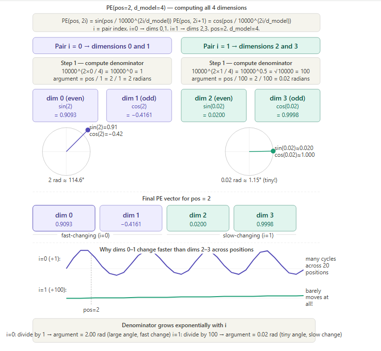

# Q20: Positional Encoding — Exercise

## Question Summary

Compute the positional encoding vector for **pos = 2** with **d_model = 4**:

```text
PE(pos, 2i)   = sin(pos / 10000^(2i / d_model))
PE(pos, 2i+1) = cos(pos / 10000^(2i / d_model))
```

Show the calculations for all 4 dimensions (i = 0 and i = 1). Why do the first two dimensions change more rapidly across positions than the last two?

---

## Setup

With `d_model = 4`, the dimensions are 0, 1, 2 and 3:

- even dimensions (0, 2) use **sine**
- odd dimensions (1, 3) use **cosine**
- `i` is the pair index: `i = 0` for dimensions 0 and 1, `i = 1` for dimensions 2 and 3

---

## Pair i = 0 (Dimensions 0 and 1)

```text
denominator = 10000^(2×0 / 4) = 10000^0 = 1
argument    = pos / 1 = 2 radians
```

```text
PE(2, 0) = sin(2) ≈ 0.9093
PE(2, 1) = cos(2) ≈ −0.4161
```

---

## Pair i = 1 (Dimensions 2 and 3)

```text
denominator = 10000^(2×1 / 4) = 10000^0.5 = √10000 = 100
argument    = pos / 100 = 0.02 radians
```

```text
PE(2, 2) = sin(0.02) ≈ 0.0200
PE(2, 3) = cos(0.02) ≈ 0.9998
```

---

## Result

```text
PE(pos = 2) = [0.9093, −0.4161, 0.0200, 0.9998]
                dim 0    dim 1   dim 2   dim 3
```



---

## Why Do the First Two Dimensions Change Faster?

The speed of change is set entirely by the denominator `10000^(2i / d_model)`, which **grows exponentially** with `i`:

| Pair | Denominator | Argument at pos = 2 | Angle moved per step |
|---|---:|---:|---|
| i = 0 | 1 | 2.00 rad | 1 rad ≈ 57° |
| i = 1 | 100 | 0.02 rad | 0.01 rad ≈ 0.57° |

- **Dimensions 0–1 (i = 0):** the argument is simply `pos`. Each step of one position moves the wave by a full radian, so a complete cycle (2π) takes only about 6 positions. These values change a lot between neighbors:

  ```text
  dim 0:  pos 1 → sin(1) ≈ 0.841,  pos 2 → sin(2) ≈ 0.909,  pos 3 → sin(3) ≈ 0.141
  ```

- **Dimensions 2–3 (i = 1):** the argument is `pos / 100`. Each step moves the wave by only 0.01 rad, so a complete cycle takes about 628 positions. Between neighbors, these values barely change.

In a real model with `d_model = 512`, the slowest pair (i = 255) has denominator `10000^(510/512) ≈ 9,650`, so one full cycle spans about **60,000 positions**.

### The clock analogy

The dimension pairs act like clock hands turning at exponentially different speeds:

- **fast pairs** (like the second hand) distinguish **nearby** positions, such as 1 and 2,
- **slow pairs** (like the hour hand) distinguish **distant** positions in long sequences.

Together, the 256 pairs in a 512-dimensional model give every position a unique code, much as hours, minutes and seconds together identify a moment of the day. The encoding needs no learned parameters and always stays within [−1, +1].

---

## Final Answer

```text
i = 0:  denominator = 1,    argument = 2 rad
        dim 0 = sin(2)    ≈  0.9093
        dim 1 = cos(2)    ≈ −0.4161

i = 1:  denominator = 100,  argument = 0.02 rad
        dim 2 = sin(0.02) ≈  0.0200
        dim 3 = cos(0.02) ≈  0.9998

PE(2) = [0.9093, −0.4161, 0.0200, 0.9998]
```

The first two dimensions change faster because their denominator is 1, so the angle increases by 1 radian per position (a high-frequency wave). The last two have denominator 100, so the angle increases by only 0.01 radian per position (a low-frequency wave). Fast dimensions encode fine local position, and slow dimensions encode coarse, long-range position.
