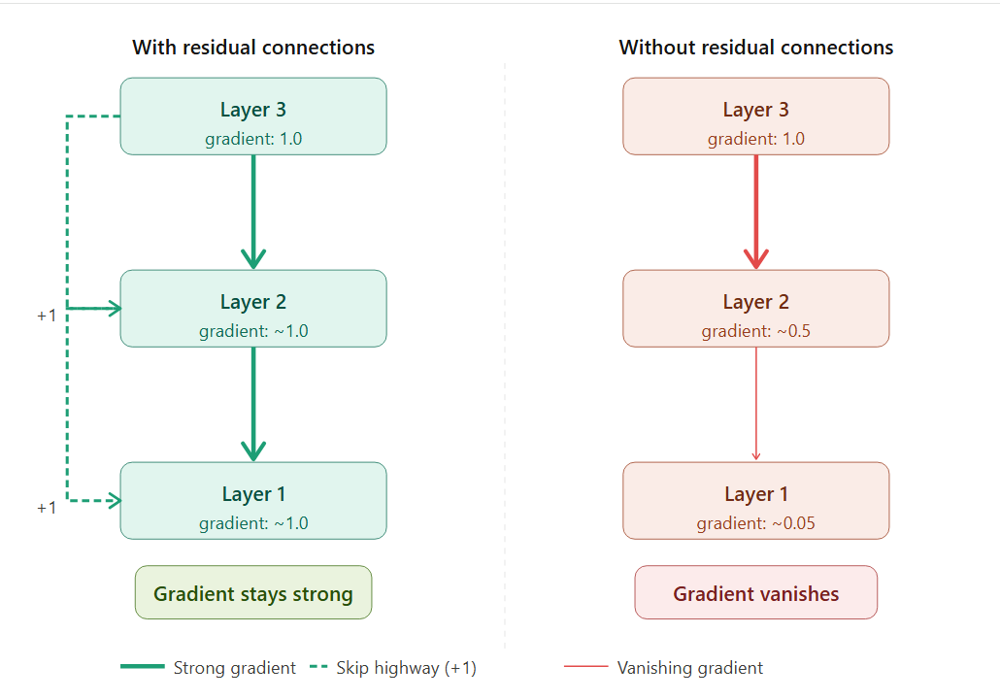

# Q23: Residual Connections — Descriptive

## Question Summary

Each Transformer sub-layer computes `LayerNorm(x + SubLayer(x))` instead of just `SubLayer(x)`. For the word "cat":

```text
x           = [0.5, 1.2, −0.3, 0.8]
SubLayer(x) = [0.1, −0.4, 0.6, 0.2]
```

1. Compute `x + SubLayer(x)`.
2. Explain why adding `x` back (the residual connection) helps prevent vanishing gradients in a 6-layer Transformer encoder.
3. What would happen during training if 6 layers were stacked without residual connections?

---

## Part A: Compute x + SubLayer(x)

| Position | x | SubLayer(x) | x + SubLayer(x) |
|---:|---:|---:|---:|
| 1 | 0.5 | 0.1 | 0.6 |
| 2 | 1.2 | −0.4 | 0.8 |
| 3 | −0.3 | 0.6 | 0.3 |
| 4 | 0.8 | 0.2 | 1.0 |

```text
x + SubLayer(x) = [0.6, 0.8, 0.3, 1.0]
```

LayerNorm is then applied to this vector (as in Q21). The question asks only for the addition step.

---

## Part B: Why the Residual Connection Prevents Vanishing Gradients

During training, the error signal travels backward from the top layer to the bottom one. In a plain deep network, the gradient is multiplied by each layer's local derivative. If those derivatives are smaller than 1, the gradient shrinks exponentially, and the lowest layers receive almost no learning signal.

With a residual connection, the layer computes `x + SubLayer(x)`. Its derivative with respect to `x` is:

```text
∂/∂x [x + SubLayer(x)] = 1 + ∂SubLayer(x)/∂x
```

The **"1"** comes from the identity path, the skip connection. It means the gradient arriving from above is passed directly to the layer below, **in addition to** whatever passes through the sub-layer. Even if `∂SubLayer/∂x` becomes very small, the identity term still carries the gradient back unchanged.

Across the whole stack, the identity paths form a **gradient highway** from the loss down to the embeddings, bypassing every sub-layer. Every layer, including layer 1, keeps receiving a useful learning signal.



---

## Part C: Six Layers Without Residual Connections

**Forward pass:** each layer must completely re-transform its input. Information about the original embedding is diluted or overwritten layer by layer, so by layer 6 important input features may be lost.

**Backward pass:** the gradient must pass through every sub-layer in sequence. Six encoder layers contain **12 sub-layers** (6 attention + 6 feed-forward), so the per-sub-layer factors multiply:

```text
0.9¹² ≈ 0.28    (already less than a third of the signal)
0.7¹² ≈ 0.014   (practically zero)
```

The bottom layers would learn very little.

**In practice:** training would be slow and unstable, or fail to converge, and the deep model could even perform worse than a shallow one. This degradation of plain deep networks is exactly what motivated residual connections in ResNet (He et al., 2016), and the Transformer adopts them around every sub-layer.

---

## Final Answer

```text
(a) x + SubLayer(x) = [0.6, 0.8, 0.3, 1.0]
```

(b) The residual connection adds an identity path, so the derivative of each block is `1 + ∂SubLayer/∂x`. The "1" passes the gradient from the layer above straight to the layer below, even when the sub-layer's own derivative is small. This creates a gradient highway through all six layers, and the early layers keep learning.

(c) Without residual connections, the gradient would be multiplied through all 12 sub-layers, e.g. `0.9¹² ≈ 0.28` or `0.7¹² ≈ 0.014`. The lower layers would barely learn, input information would be progressively lost in the forward pass, and training would be slow, unstable, or fail entirely.

---

## References

- He, K., Zhang, X., Ren, S., & Sun, J. (2016). Deep Residual Learning for Image Recognition. *CVPR*.
- Vaswani, A., et al. (2017). Attention Is All You Need. *NeurIPS*, Section 3.1.
