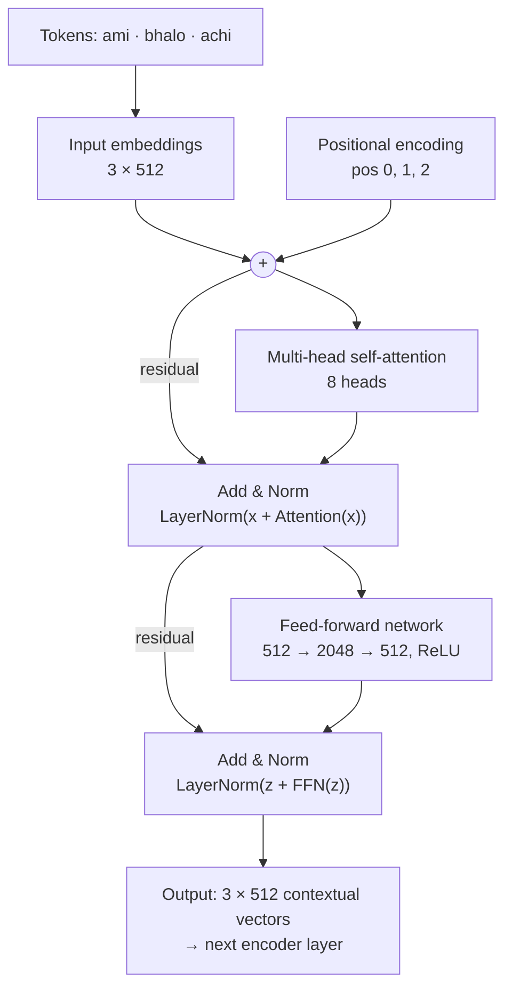
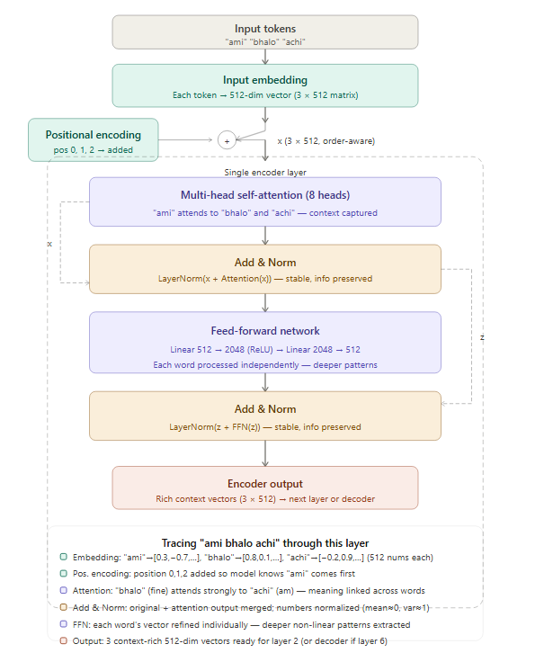

# Q25: Encoder Architecture — Descriptive

## Question Summary

Draw the complete architecture of a single Transformer encoder layer, labelling: input embeddings, positional encoding, multi-head self-attention, Add & Norm, feed-forward network, and the second Add & Norm. Trace how the Bangla sentence **"ami bhalo achi"** (I am fine) flows through this layer.

---

## Architecture





---

## Tracing "ami bhalo achi"

### Step 1: Input embedding

The sentence is split into 3 tokens: `["ami", "bhalo", "achi"]`. Each is looked up in a learned embedding table and becomes a 512-dimensional vector carrying its general meaning.

```text
Output: 3 × 512 matrix
```

### Step 2: Positional encoding

Self-attention has no built-in sense of order (see Q19), so a sinusoidal positional encoding is **added** to each embedding: "ami" gets PE(0), "bhalo" gets PE(1), "achi" gets PE(2). The model can now tell that "ami" comes first.

```text
Output: 3 × 512, now order-aware
```

### Step 3: Multi-head self-attention

Every token attends to every token, including itself. For example, "bhalo" (fine) attends strongly to "achi" (am), since together they express a state, and "achi" attends to "ami", its subject. With 8 heads in parallel, different heads can capture different relationships, such as subject–verb links and the predicate "bhalo achi".

```text
Output: 3 × 512, each vector enriched with context from the whole sentence
```

### Step 4: First Add & Norm

The layer's input is added back to the attention output (the residual connection), then layer normalization is applied:

```text
z = LayerNorm(x + MultiHeadAttention(x))
```

The residual keeps the original information and gives gradients a direct path. LayerNorm keeps each token's vector at a stable scale.

### Step 5: Feed-forward network

Each token's vector passes **independently** through the same two-layer network:

```text
FFN(z) = W₂ · ReLU(W₁ · z + b₁) + b₂      (512 → 2048 → 512)
```

This adds non-linear processing capacity to each position. The three tokens do **not** interact in this step; all mixing between tokens happens in attention.

### Step 6: Second Add & Norm

The same pattern is applied around the FFN:

```text
output = LayerNorm(z + FFN(z))
```

The result is a 3 × 512 matrix of contextual vectors for "ami", "bhalo" and "achi", passed to the next encoder layer. After the last of the 6 layers, these vectors become the encoder output that the decoder attends to.

---

## Summary

| Step | Component | Shape | What happens to "ami bhalo achi" |
|---|---|---|---|
| 1 | Input embedding | 3 × 512 | Tokens become vectors |
| 2 | + Positional encoding | 3 × 512 | Order information added |
| 3 | Multi-head self-attention | 3 × 512 | Each word gathers context from the others |
| 4 | Add & Norm | 3 × 512 | Residual + normalization |
| 5 | Feed-forward | 3 × 512 | Per-token non-linear transformation |
| 6 | Add & Norm | 3 × 512 | Residual + normalization; output to the next layer |

---

## Final Answer

A Transformer encoder layer receives token embeddings with positional encodings added. It applies **multi-head self-attention**, followed by **Add & Norm** (residual connection + layer normalization), then a position-wise **feed-forward network**, followed by a second **Add & Norm**. For "ami bhalo achi", the three tokens become 512-dimensional vectors, gain position information, exchange context through attention (e.g., "bhalo" attends to "achi", and "achi" to "ami"), are stabilized by residual addition and normalization, are transformed individually by the FFN, and are normalized again. The output is three contextual vectors of the same shape, ready for the next layer.
