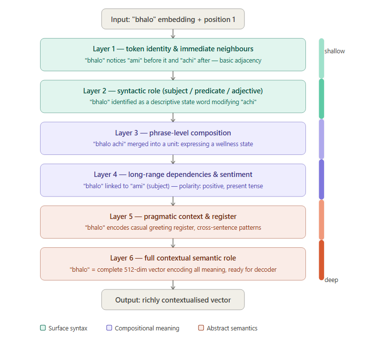
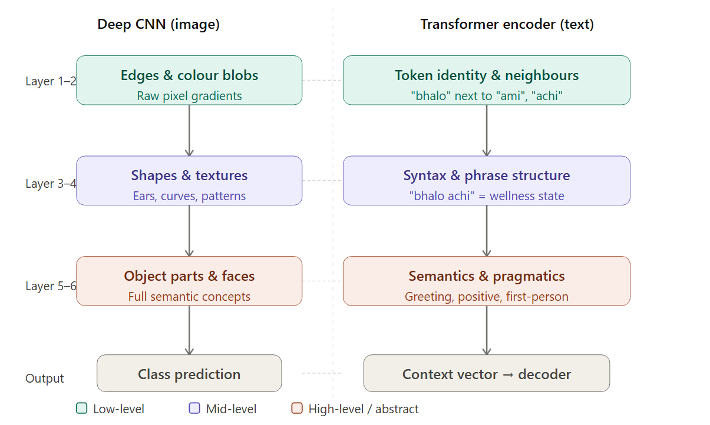

# Q26: Encoder Architecture — Analytic

## Question Summary

The Transformer encoder stacks 6 identical layers. What happens to the representation of a word like **"bhalo"** (good/fine) as it passes through layers 1 → 2 → … → 6? How does each successive layer refine it? Draw an analogy to how deep CNNs learn low-level to high-level features.

---

## Identical Structure, Different Roles

All 6 encoder layers have the same structure (multi-head attention + FFN + two Add & Norm blocks), but each has its **own weights**, trained independently. Each layer receives the richer output of the layer below and refines it further.

---

## Layer-by-Layer Refinement of "bhalo"

*The progression below is an idealized picture. Probing studies of trained Transformers (e.g., Tenney et al., 2019) find that lower layers tend to encode more surface and syntactic information and higher layers more semantic information, but the boundaries between layers are gradual, not clean.*

**Layer 1: surface features.** "bhalo" enters as its embedding plus positional encoding, carrying its general meaning ("good/fine") and position. The first attention layer mainly picks up **local context**: "bhalo" sits between "ami" and "achi".

**Layer 2: syntactic role.** The representation starts to encode grammatical function. "bhalo" is not the subject or the verb; it is a **predicate complement** describing a state, tied to "achi" (am).

**Layer 3: phrase composition.** "bhalo" and "achi" begin to function as a unit. The vector for "bhalo" now carries information from "achi", reflecting that together they express a state of well-being.

**Layer 4: longer-range links and sentiment.** "bhalo" is linked to "ami" (I): the subject is in the state "bhalo achi". The representation now reflects **positive sentiment**, **present tense** and **first person**.

**Layer 5: pragmatics and register.** In this sentence, "bhalo" is part of a **casual greeting response** ("I'm fine"), not an evaluation like "the work is good". Patterns learned from many similar sentences let the representation reflect this usage.

**Layer 6: full contextual meaning.** The final 512-dimensional vector combines the word's lexical meaning, its syntactic role, its relations to "ami" and "achi", its positive sentiment, and its conversational register. This is what the decoder's cross-attention will draw on.

---

## The CNN Analogy

| Depth | Deep CNN (vision) | Transformer encoder (language) |
|---|---|---|
| Layers 1–2 | Edges, colour blobs | Token identity, neighboring words |
| Layers 3–4 | Textures, shapes, object parts | Syntax, phrase structure |
| Layers 5–6 | Whole objects, faces | Semantics, pragmatics |
| Output | Class prediction | Contextual vectors for the decoder |

The common principle: **simple, repeated units** (convolutional filters or encoder blocks), stacked deeply, learn a **hierarchy of abstraction from data**. Nobody hard-codes "this layer detects faces" or "this layer detects sentiment"; these representations emerge during training.

One difference is worth noting. A CNN's receptive field grows gradually with depth, whereas self-attention can connect **any two words from the very first layer**. The Transformer's hierarchy is therefore one of increasingly **abstract** features, not of increasingly **wide** context windows.

---

## Final Answer

As "bhalo" passes through the 6 encoder layers, each layer's attention gathers context from the other words and its FFN transforms the result, so the representation is progressively refined. It moves from the word's general meaning and local neighbors (lower layers), through its syntactic role and composition with "achi" (middle layers), to sentence-level meaning such as positive sentiment and its use as a greeting response (upper layers). This mirrors a deep CNN, whose early layers detect edges, middle layers shapes and parts, and later layers whole objects. In both cases, stacking identical units lets a feature hierarchy emerge from training. Unlike CNNs, however, attention gives the Transformer global context at every layer.

---

## Reference

- Tenney, I., Das, D., & Pavlick, E. (2019). BERT Rediscovers the Classical NLP Pipeline. *ACL*.
