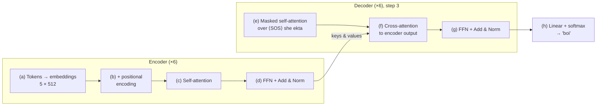

# Q29: Full Pipeline — Analytic

## Question Summary

Trace the translation of **"She is reading a book"** into **"she ekta boi porchhe"** through a Transformer. For each stage, write one sentence describing what happens:

- (a) Input tokenization and embedding
- (b) Positional encoding addition
- (c) Encoder self-attention
- (d) Encoder feed-forward + residual + layer norm
- (e) Decoder masked self-attention (at step 3, producing "boi")
- (f) Decoder cross-attention (at step 3)
- (g) Decoder feed-forward + residual + layer norm
- (h) Output linear layer + softmax

---

## The Pipeline at a Glance

---

## Encoder Side

### (a) Input tokenization and embedding

**One sentence:** The English sentence is split into tokens `[She, is, reading, a, book]`, and each token is mapped to a learned 512-dimensional embedding vector, giving a 5 × 512 matrix.

*Details:* tokenization converts text into vocabulary IDs (real systems use subword units such as BPE; here each word is one token for simplicity). In the original Transformer, the embeddings are multiplied by √d_model before the next step.

### (b) Positional encoding addition

**One sentence:** A sinusoidal positional encoding vector is added element-wise to each embedding, so each token's vector carries both its meaning and its position (0–4) in the sentence.

*Details:* without this step, self-attention cannot tell word order (Q19). The matrix stays 5 × 512.

### (c) Encoder self-attention

**One sentence:** Every English token attends to every token in the sentence through multi-head attention, so each vector absorbs relevant context, e.g., "reading" draws on "She" (who is reading) and "book" (what is being read).

*Details:* attention is **unmasked** here, because the whole source sentence is known in advance. Each of the 8 heads uses its own W_Q, W_K, W_V in a 64-dimensional subspace (Q17, Q18).

### (d) Encoder feed-forward + residual + layer norm

**One sentence:** Each token's vector is transformed independently by a two-layer feed-forward network (512 → 2048 → 512), with a residual connection and layer normalization after both the attention and FFN sub-layers, and the whole layer is repeated 6 times to produce the final encoder output.

*Details:* the encoder output is a 5 × 512 matrix of contextual vectors, one per English word. It is computed **once** and reused by the decoder at every generation step.

---

## Decoder Side (at step 3)

At step 3, the decoder has already generated **"she"** and **"ekta"**, so its input is `[<SOS>, she, ekta]`, embedded and position-encoded as in (a) and (b).

### (e) Decoder masked self-attention

**One sentence:** Each target position attends only to itself and earlier positions, so the position that predicts the next word sees `<SOS> she ekta` and is prevented from seeing "boi" or any later token.

*Details:* the causal mask sets future attention scores to −∞ (Q28). At inference, future tokens do not exist anyway. During training, the mask stops the model from copying the answer.

### (f) Decoder cross-attention

**One sentence:** Queries from the decoder's current state are compared with keys from the encoder output, and the decoder collects the corresponding values. At step 3, it attends most strongly to the encoder vector for **"book"**, the source word that "boi" translates.

*Details:* this is where source and target meet. Queries come from the decoder; keys and values come from the encoder output from (d). It plays the role of the alignment that Bahdanau attention performed in RNN models (Q30).

### (g) Decoder feed-forward + residual + layer norm

**One sentence:** The resulting vector passes through the position-wise feed-forward network, with residual connections and layer normalization around all three decoder sub-layers, and this is repeated across the 6 decoder layers.

*Details:* after the last layer, the vector at the current position summarizes what has been generated so far ("she ekta") and what the source says ("book").

### (h) Output linear layer + softmax

**One sentence:** A linear layer projects the final decoder vector to a score for every word in the Bangla vocabulary, softmax turns the scores into probabilities, and the highest-probability word, **"boi"**, is emitted and fed back as input for step 4.

*Details:* generation continues until the model outputs `<EOS>`; step 4 produces "porchhe". In practice, beam search is often used instead of always taking the single most probable word.

---

## Summary Table

| Stage | Component | What happens in this example |
|---|---|---|
| (a) | Tokenization + embedding | 5 English tokens → 5 × 512 vectors |
| (b) | Positional encoding | Position 0–4 added to each vector |
| (c) | Encoder self-attention | "reading" attends to "She" and "book" |
| (d) | Encoder FFN + Add & Norm (×6) | Final 5 × 512 encoder output |
| (e) | Decoder masked self-attention | Sees `<SOS> she ekta`; "boi" is hidden |
| (f) | Decoder cross-attention | Attends to the encoder vector for "book" |
| (g) | Decoder FFN + Add & Norm (×6) | Final decoder vector at the current position |
| (h) | Linear + softmax | Highest probability: "boi" → fed back for step 4 |

---

## Final Answer

- **(a)** The sentence is split into 5 tokens, each mapped to a learned 512-dimensional embedding.
- **(b)** A sinusoidal positional encoding is added to each embedding so the model knows word order.
- **(c)** Each English token attends to all tokens, e.g., "reading" gathers context from "She" and "book".
- **(d)** A per-token feed-forward network with residual connections and layer normalization refines the vectors, and 6 such layers produce the encoder output.
- **(e)** At step 3, masked self-attention lets the decoder see only `<SOS> she ekta`, hiding "boi" and later words.
- **(f)** Cross-attention uses the decoder's queries against the encoder's keys and values, focusing on "book".
- **(g)** A feed-forward network with residual connections and layer normalization refines the result through 6 decoder layers.
- **(h)** A linear layer and softmax give a probability for every Bangla word; "boi" has the highest probability and is fed back for step 4.

---

## Reference

- Vaswani, A., et al. (2017). Attention Is All You Need. *NeurIPS*, Sections 3.1–3.5.
